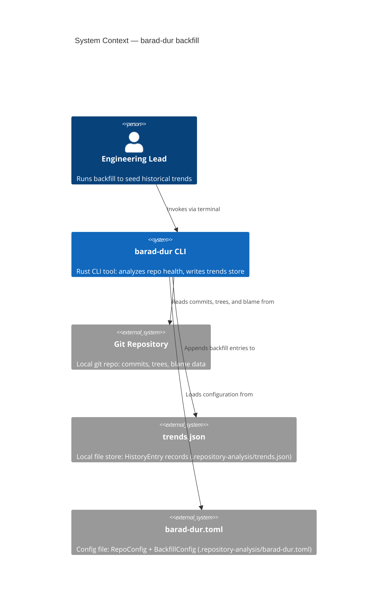
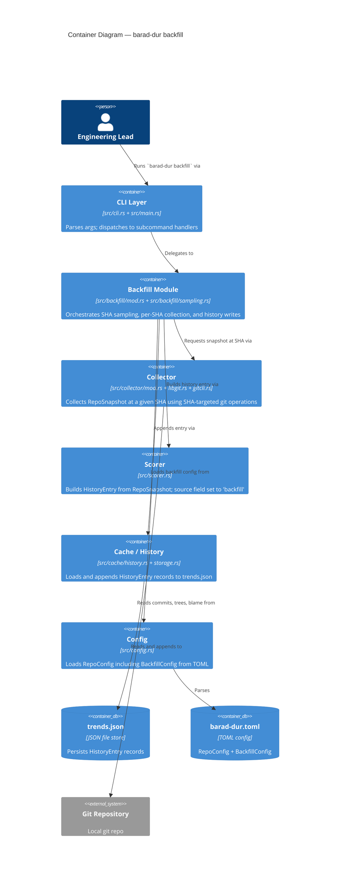
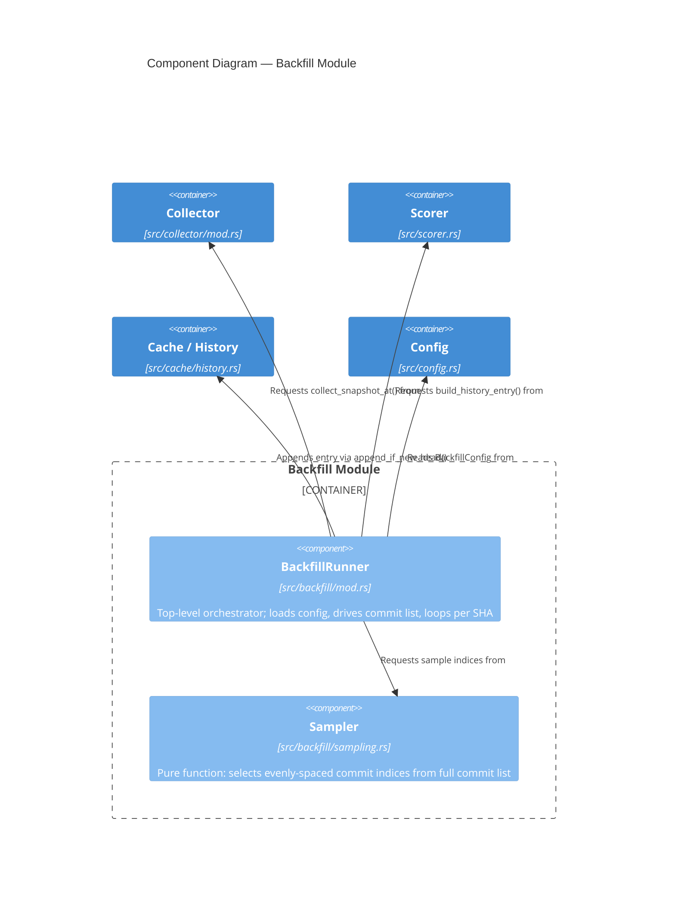

# Architecture Design — adaptive-trends-period (backfill)

**Feature**: `barad-dur backfill` subcommand
**Date**: 2026-03-19
**Author**: Morgan (Solution Architect)
**Status**: Ready for handoff

---

## System Context

`barad-dur` is a Rust CLI tool that analyzes git repository health and writes scored `HistoryEntry` records to a local trends store (`.repository-analysis/trends.json`). The `backfill` subcommand retroactively seeds this store by analyzing past commits at their original SHAs, without modifying the working tree.

### Quality Attributes (priority order)

1. **Non-destructive** — working tree and git state must be unchanged after backfill
2. **Correctness** — backfill entries must be distinguishable from live entries; no duplicate SHAs
3. **Performance** — `--no-blame` target: < 120 s on a 1000-commit repository
4. **Maintainability** — backfill orchestration isolated from existing analyze flow
5. **Testability** — sampling logic is pure and independently testable

---

## C4 Level 1 — System Context



---

## C4 Level 2 — Container



---

## C4 Level 3 — Backfill Module (component detail)

The backfill module has more than five internal responsibilities and warrants a component diagram.



---

## Data Flow

```
BackfillArgs (no_blame: bool)
  -> backfill::run(&args, repo_path)
       -> config::load() -> RepoConfig { backfill: BackfillConfig { sample_count } }
       -> collector::collect_all_commits(repo_path) -> Vec<String>   // all SHAs, newest-first
       -> sampling::select_samples(&commits, sample_count) -> Vec<String>   // evenly-spaced subset
       -> for each sha in samples:
            -> collector::collect_snapshot_at(sha, skip_blame, repo_path) -> RepoSnapshot
                   [ file_metrics = HashMap::new()  -- complexity skipped, see ADR-005 ]
            -> scorer::build_report(&snapshot) -> AnalysisReport
            -> scorer::build_history_entry(&report, source = Some("backfill")) -> HistoryEntry
            -> cache::append_if_new_head(&entry, repo_path)   // no-op if SHA already present
            -> on git error: warn and continue (Q2 resolution)
       -> return BackfillSummary { analyzed, skipped, warned }
```

---

## Component Map

### `src/cli.rs` (modified)

Add `Backfill(BackfillArgs)` variant to the `Commands` enum. `BackfillArgs` carries `no_blame: bool` (maps to `--no-blame` flag).

### `src/main.rs` (modified)

Add dispatch arm: `Commands::Backfill(args) => backfill::run(&args, &local_path)?`. Pattern follows existing `Commands::Init` dispatch.

### `src/backfill/mod.rs` (NEW)

Public entry point for the backfill flow. Owns orchestration: load config, collect all commits, delegate sampling, loop per SHA, collect snapshot, build entry, append to history. Returns `BackfillSummary`. No domain logic; all domain decisions delegated to collector and scorer.

### `src/backfill/sampling.rs` (NEW)

Pure function module. No I/O, no git calls, no side-effects. Input: `&[String]` (commit SHAs, ordered newest-first), `usize` (desired count). Output: `Vec<String>` (selected SHAs). Algorithm: evenly-spaced index selection (see data-models.md). Independently testable without any git infrastructure.

### `src/collector/libgit.rs` (modified)

Add two SHA-targeted variants alongside existing functions:

- `collect_commits_at(repo, sha_str, window)` — uses `revwalk.push(sha_oid)` instead of `revwalk.push_head()`; same logic otherwise
- `collect_files_at(repo, sha_str)` — resolves `repo.find_commit(sha_oid)?.tree()` instead of `repo.head()`; returns file list from that historical tree

Existing `collect_commits` and `collect_files` are unchanged; no regression risk.

### `src/collector/gitcli.rs` (modified)

`blame_file()` gains an `at_rev: Option<&str>` parameter. When `Some(sha)`, the git invocation becomes `git blame <sha> -- <file>`. When `None`, existing behavior is preserved. Change is backward-compatible.

### `src/collector/mod.rs` (modified)

Add `collect_snapshot_at(sha: &str, skip_blame: bool, repo_path: &Path) -> Result<RepoSnapshot>` method on `Collector`. Uses SHA-targeted variants from libgit.rs and gitcli.rs. Sets `file_metrics = HashMap::new()` unconditionally (ADR-005). Passes `at_rev = Some(sha)` to blame when `skip_blame = false`.

### `src/config.rs` (modified)

Add `BackfillConfig { sample_count: u32 }` as a named field on `RepoConfig`. TOML section `[backfill]`. Default `sample_count = 10` via `serde(default)`. Valid range enforced in `backfill::run`: clamp to min 2, max 100.

### `src/scorer.rs` (modified)

Add `pub source: Option<String>` to `HistoryEntry` with `#[serde(skip_serializing_if = "Option::is_none")]`. Live `analyze` flow sets no `source` (field omitted from JSON). Backfill sets `source = Some("backfill".to_string())`.

---

## Integration Points — Changed Signatures

| Location | Change | Notes |
|---|---|---|
| `src/cli.rs` | Add `Backfill(BackfillArgs)` to `Commands` enum | New variant; no existing arm touched |
| `src/main.rs` | Add dispatch arm for `Commands::Backfill` | One new `match` arm |
| `src/collector/libgit.rs` | Add `collect_commits_at(repo, sha, window)` | New function; `collect_commits` unchanged |
| `src/collector/libgit.rs` | Add `collect_files_at(repo, sha)` | New function; `collect_files` unchanged |
| `src/collector/gitcli.rs` | `blame_file(path, authors, progress, at_rev: Option<&str>)` | Existing callers pass `None`; backward-compatible |
| `src/collector/mod.rs` | Add `collect_snapshot_at(sha, skip_blame, repo_path)` | New method on `Collector` |
| `src/config.rs` | Add `backfill: BackfillConfig` field to `RepoConfig` | Serde default; existing TOML files remain valid |
| `src/scorer.rs` | `HistoryEntry.source: Option<String>` | Skip-serializing-if None; backward-compatible |

---

## Complexity Metric Decision

`collect_file_metrics()` reads source files from the working tree via `std::fs::read_to_string(&abs_path)`. At a historical SHA, the working tree reflects current HEAD — not the historical commit — and files present in that historical tree may have been renamed or deleted since.

**Decision**: `collect_snapshot_at()` passes `file_metrics: HashMap::new()` to every historical snapshot. See ADR-005 for full rationale.

**Consequences for scores**:

| Score category | Data source | Impact at historical SHAs |
|---|---|---|
| Complexity sub-scores (cyclomatic, LOC, public methods) | file_metrics | Zero — absent from backfill entries |
| Health score (commit frequency, churn) | Commit history | Fully accurate |
| Team score (author diversity, ownership) | Commit history + blame | Accurate without blame; partial with blame |
| Evolution score (hotspots, age) | Commit history | Fully accurate |
| Hygiene score (branch, tag, stale) | Commit history | Fully accurate |

Complexity-derived sub-scores will read as 0 in the trends dashboard for backfill entries. The `source = "backfill"` field enables the dashboard to render these differently (e.g., hollow dots, tooltip annotation).

---

## Changed Assumptions

DISCUSS `requirements.md` FR-BF-06 stated "same `HistoryEntry` schema." The DESIGN adds `source: Option<String>` to `HistoryEntry`. This is a backward-compatible additive change: existing `trends.json` files with no `source` field deserialize correctly (field is `None`). No `schema_version` bump is required. See ADR-006.

DISCUSS `requirements.md` listed `source: 'backfill'` tag as out of scope. Q3 resolution (confirmed by user during DISCUSS wave) overrides this: the field is added.

---

## Architecture Enforcement

Style: Modular monolith with ports-and-adapters (unchanged from existing architecture)
Language: Rust
Tool: `cargo deny` (dependency policy) + module visibility rules enforced by Rust compiler

Rules to enforce:
- `src/backfill/sampling.rs` must not import any I/O crates (`std::fs`, `std::process`, `git2`)
- `src/backfill/` must not import from `src/renderer/`
- `src/collector/` must not import from `src/backfill/`
- All cross-module communication through public function signatures (Rust `pub` + `pub(crate)` visibility controls)

The Rust module system provides structural enforcement natively: `pub(crate)` limits visibility, and compiler errors surface violations at build time. No additional tooling beyond `cargo check` is required.

---

## External Integrations

No external HTTP APIs or third-party services involved. All integration is with the local git repository (via `git2` and `process::Command`). No contract tests required.
