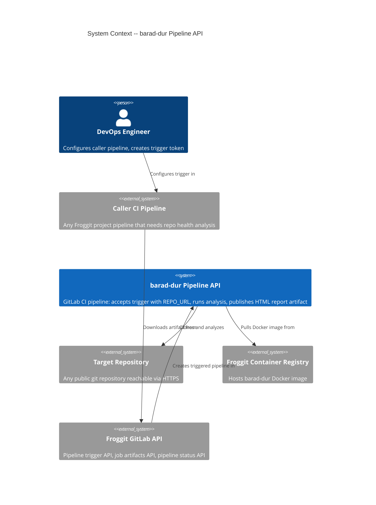
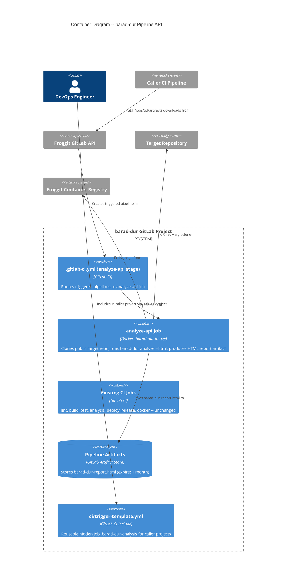

# Architecture Design -- gitlab-pipeline-api

**Feature**: Distribute barad-dur as a CI/CD-triggered API on Froggit
**Date**: 2026-03-25
**Author**: Morgan (Solution Architect)
**Status**: Ready for handoff

---

## System Context

barad-dur is a Rust CLI tool (~31MB Docker image) that analyzes git repository health and produces scored HTML reports. This feature exposes it as a "pipeline API" -- anyone with a public git repository can trigger a barad-dur CI pipeline via the GitLab Pipeline Trigger API, passing their repository URL. The triggered pipeline clones the target, runs analysis, and publishes a self-contained interactive HTML report as a downloadable pipeline artifact.

No Rust code changes are required. The entire feature is deliverable through CI configuration (`.gitlab-ci.yml`), a reusable CI template (`ci/trigger-template.yml`), and documentation.

### Quality Attributes (priority order)

1. **Time-to-market** -- CI-only feature, no compilation, ship in days
2. **Maintainability** -- Single `.gitlab-ci.yml` file, no new services to operate
3. **Testability** -- End-to-end verifiable via a single `curl` trigger
4. **Security** -- Trigger tokens masked, no credential leakage in artifacts
5. **Isolation** -- Each triggered run is a fresh container, no shared state

---

## C4 Level 1 -- System Context



---

## C4 Level 2 -- Container



---

## Pipeline Architecture

### New Stage and Job

A new stage `api` is added to `.gitlab-ci.yml` containing a single job `analyze-api`. This job runs **only** when the pipeline source is `trigger` and `REPO_URL` is provided. It is completely isolated from the existing CI pipeline -- existing stages (lint, build, test, analysis, deploy, release, docker) are unaffected.

### Job Flow

```
Pipeline Trigger API
        |
        v
  [analyze-api job]
        |
        +-- 1. Validate inputs (REPO_URL required, MIN_SCORE is integer)
        +-- 2. Clone target repo (git clone --branch $REPO_BRANCH --depth 0 $REPO_URL)
        +-- 3. Map CATEGORIES to CLI flags
        +-- 4. Run: barad-dur analyze /tmp/target --html -o barad-dur-report.html $ANALYSIS_OPTIONS $CATEGORY_FLAGS
        +-- 5. If MIN_SCORE set: barad-dur gate /tmp/target --min-score $MIN_SCORE
        +-- 6. Exit 0 (success) or 1 (gate fail / error)
        |
        v
  [artifact: barad-dur-report.html]
```

### Stage Isolation

The `analyze-api` job uses `rules:` to ensure it never runs during normal push/merge pipelines. Existing jobs use different triggers (push, tag, schedule) and are never affected by the trigger source.

```
rules:
  - if: $CI_PIPELINE_SOURCE == "trigger" && $REPO_URL
```

All other existing jobs implicitly exclude `trigger` source because they either:
- Have no `rules:` (run on push/merge by default)
- Have explicit rules for `$CI_COMMIT_TAG`, `$CI_COMMIT_BRANCH`, or `$CI_PIPELINE_SOURCE == "schedule"`

---

## API Contract

### Trigger Request

| Element | Value |
|---------|-------|
| Endpoint | `POST /api/v4/projects/:id/trigger/pipeline` |
| Auth | Pipeline trigger token (created in project settings) |
| Required variables | `REPO_URL` -- HTTPS URL of target repository |
| Optional variables | `REPO_BRANCH` (default: "main"), `ANALYSIS_OPTIONS` (CLI flags), `MIN_SCORE` (integer threshold), `CATEGORIES` (comma-separated: health,team,evolution,hygiene) |
| Response | `201 Created` with pipeline object (includes `id`, `web_url`) |

### Trigger Variables

| Variable | Required | Default | Type | Validation |
|----------|----------|---------|------|------------|
| `REPO_URL` | Yes | -- | HTTPS URL | Must start with `https://`; clone must succeed |
| `REPO_BRANCH` | No | `main` | String | Must be a valid branch name in target repo |
| `ANALYSIS_OPTIONS` | No | empty | String | Passed to CLI; shell-injection prevention via controlled quoting |
| `MIN_SCORE` | No | -- | Integer 0-100 | Must be a positive integer; triggers gate check |
| `CATEGORIES` | No | all | CSV | Valid values: health, team, evolution, hygiene (case-insensitive) |

### Response Artifact

| Element | Value |
|---------|-------|
| Artifact name | `barad-dur-report.html` |
| Format | JSON (matches `barad-dur analyze --json --pretty` output schema) |
| Retention | 1 month (configurable via `expire_in`) |
| Availability | `artifacts:when: always` -- produced even on gate failure |
| Download | `GET /api/v4/projects/:id/jobs/:job_id/artifacts/barad-dur-report.html` |

### Exit Codes

| Code | Meaning |
|------|---------|
| 0 | Analysis succeeded (and gate passed, if MIN_SCORE set) |
| 1 | Gate failure (score < MIN_SCORE) or analysis/clone error |

### Error Discrimination

The job log distinguishes three error classes:
1. **Input validation error** -- "ERROR: REPO_URL is required" / "ERROR: MIN_SCORE must be a positive integer"
2. **Clone failure** -- "ERROR: Failed to clone repository"
3. **Gate failure** -- "FAIL: overall score N < threshold M"

---

## Caller Integration Pattern

### Direct curl Integration

The caller pipeline uses three GitLab API calls:

1. **Trigger**: `POST /trigger/pipeline` with token + variables -> returns pipeline ID
2. **Poll**: `GET /pipelines/:id` every 15 seconds until status is terminal (success/failed/canceled)
3. **Download**: `GET /jobs/:job_id/artifacts/barad-dur-report.html` using `CI_JOB_TOKEN`

### Reusable Template Integration

Projects include `ci/trigger-template.yml` via GitLab CI `include:project:` directive and extend the hidden job `.barad-dur-analysis` with their specific variables. This reduces integration from ~50 lines of curl-based script to ~10 lines of YAML.

### Caller Requirements

- **Minimal**: `curl` and `jq` available in CI image (true for most standard images)
- **Authentication**: `BARAD_DUR_TRIGGER_TOKEN` (masked CI variable) and `BARAD_DUR_PROJECT_ID` (CI variable)
- **Polling**: 15-second interval, configurable max duration (default 30 minutes)

---

## External Integration Points

This design involves the following external integrations that require contract awareness:

| Integration | Type | Risk | Contract Test Recommendation |
|-------------|------|------|------------------------------|
| GitLab Pipeline Trigger API | Froggit instance API | Medium -- API versioned by GitLab but Froggit version may lag | Smoke test: trigger a pipeline and verify 201 response |
| GitLab Job Artifacts API | Froggit instance API | Medium -- artifact path format may change | Smoke test: download artifact from a known pipeline |
| GitLab Pipeline Status API | Froggit instance API | Low -- stable `GET /pipelines/:id` endpoint | Covered by polling logic |
| Target Repository (git clone) | Git over HTTPS | High -- auth, network, branch existence | Input validation + clear error messages in job script |

**Handoff annotation for platform-architect**: Contract tests recommended for GitLab Trigger API, Artifacts API, and Pipeline Status API -- consumer-driven smoke tests (simple curl assertions) to detect breaking changes when Froggit upgrades GitLab versions.

---

## Security Considerations

1. **Trigger token isolation**: Token is created per-project, masked by GitLab in logs, stored as caller CI variable (masked + protected)
2. **No credential leakage in artifacts**: The analyze-api job script must not redirect environment variables or token values into the JSON artifact
3. **Shell injection prevention**: `ANALYSIS_OPTIONS` is the highest-risk variable. The job script must use controlled argument construction (not raw `eval`). Recommended: validate against an allowlist of known flags or use shell quoting with `set -euo pipefail`
4. **Minimal attack surface**: The Docker image is scratch-based (~31MB) with only git, barad-dur, and SSL certs -- no shell beyond the CI runner's shell executor
5. **Network isolation**: The analyze-api job only needs outbound HTTPS to clone target repos. No inbound listeners.

---

## Deployment Architecture

No new infrastructure is required. The feature uses existing Froggit CI infrastructure:

| Component | Provided By | Status |
|-----------|-------------|--------|
| CI runners (Docker executor) | Froggit shared runners | Exists |
| Container registry | Froggit project registry | Exists |
| Docker image (barad-dur) | Existing `docker` stage in CI | Exists |
| Pipeline trigger API | Froggit GitLab instance | Exists |
| Artifact storage | Froggit project quota | Exists |

### Prerequisite

The Docker image must be built and pushed to the registry **before** any trigger can use it. This is already handled by the existing `docker` stage which runs on every push to the default branch and on version tags.

---

## Concurrency Model

- **Default**: Parallel execution. Each triggered pipeline runs in its own container with no shared state. Multiple simultaneous triggers are safe.
- **Optional**: `resource_group: barad-dur-analysis` can be added to serialize execution when runner capacity is limited.
- **Guidance**: For >10 concurrent triggers, recommend staggering (cron offset) or resource group serialization.

---

## Quality Attribute Strategies

| Attribute | Strategy |
|-----------|----------|
| Time-to-market | CI-only feature, no compilation, no new services |
| Maintainability | Single file change (.gitlab-ci.yml) + one template file + docs |
| Testability | End-to-end: trigger pipeline, verify artifact. No unit tests needed (no code). |
| Security | Masked tokens, no eval, scratch image, no credential in artifacts |
| Reliability | `artifacts:when: always` preserves report on gate failure; clear error messages for each failure class |
| Performance | `--skip-blame` documented for large repos; 30-minute default timeout |
| Isolation | Fresh container per trigger; no shared cache or /tmp between jobs |
