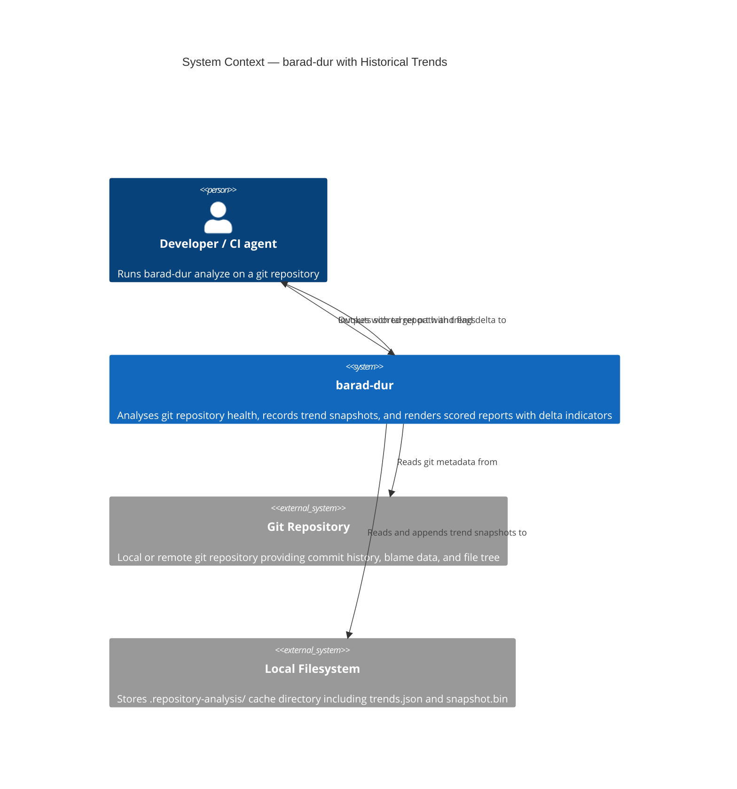
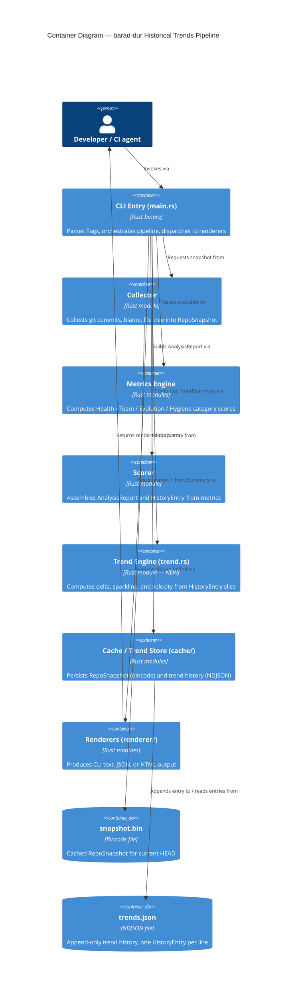

# Architecture Design — Historical Trends

Feature: `historical-trends`
Wave: DESIGN
Date: 2026-03-18
Author: Morgan (Solution Architect)

---

## Executive Summary

The `historical-trends` feature extends barad-dur's existing forward-only snapshot recording capability (already implemented in `cache::history`) to surface trend analytics in all three output modes (CLI, JSON, HTML). The design reuses every existing component; it adds one new pure-computation module (`src/trend.rs`), extends three renderer modules, and adds one CLI flag. No new dependencies, no storage format change beyond a constant rename and two new fields.

---

## C4 Level 1 — System Context



---

## C4 Level 2 — Container



---

## Pipeline execution order

```
1. Parse CLI flags (cli.rs)
2. Resolve target (local path or remote clone)
3. Load config (.repository-analysis/barad-dur.toml)
4. Collect snapshot (cache hit or full collect)
5. Compute metrics (health / team / evolution / hygiene)
6. Build AnalysisReport (scorer::build_report)
7. Load trend history (cache::history::load_history)   ← moved before scoring output
8. Compute TrendSummary (trend::compute_trend)          ← NEW
9. Append current entry (cache::history::append_if_new_head)
10. Render output (renderer::cli / json / html)
    - CLI:  always receives TrendSummary
    - JSON: receives TrendSummary only when --trend
    - HTML: reads report.history directly (DA-03)
11. Write output (stdout / file)
```

Step 7 must occur before step 8 so that `compute_trend` receives the history *without* the current entry. The current entry is passed separately so the sparkline can include the current score.

---

## Integration point: `--trend` flag threading

```
AnalyzeArgs.trend (bool)
  │
  ├── main.rs: if args.trend { pass trend_data = Some(&summary) } else { None }
  │              for JSON renderer only
  │
  ├── CLI renderer: always receives Option<&TrendSummary>
  │   - shows delta line when Some(summary) and !summary.delta.is_first
  │   - shows full table when Some(summary) AND args.trend
  │
  └── HTML renderer: ignores args.trend entirely (DA-03)
      reads report.history always
```

---

## Renderer injection strategy

Each renderer receives trend data through its function signature, not through `AnalysisReport`. This keeps `AnalysisReport` unchanged (NFR-03) and makes the injection point explicit and testable.

| Renderer | Current signature | New signature |
|---|---|---|
| `renderer::cli::render` | `(report: &AnalysisReport, verbosity: u8) -> String` | `(report: &AnalysisReport, verbosity: u8, trend: Option<&TrendSummary>, show_full_history: bool) -> String` |
| `renderer::json::render` | `(report: &AnalysisReport, pretty: bool) -> Result<String>` | `(report: &AnalysisReport, pretty: bool, trend: Option<&TrendSummary>) -> Result<String>` |
| `renderer::html::render` | `(report: &AnalysisReport) -> Result<String>` | Unchanged — HTML reads `report.history` |

The `TrendSummary` type is defined in `src/trend.rs` and imported by renderers. No circular dependency: `trend.rs` depends on `scorer.rs` types; `renderer/*.rs` depends on `trend.rs` types. The dependency arrow points: `renderer → trend → scorer → (nothing above)`.

---

## Branch isolation (D-04)

`compute_trend` filters the history slice to entries where `entry.branch == current_branch`. Entries with empty `branch` (legacy, written before this feature) are treated as "unknown branch" and excluded from delta computation; a `branch_mismatch_warning = true` is set on the summary. This is safe: the first run after upgrade will always show "first snapshot recorded" for any branch, which is accurate.

---

## Corrupt/missing trend store (FR-08)

Handled in `cache::history::load_history`. If the file cannot be parsed as NDJSON (e.g. it is binary garbage), the existing silent-skip-per-line behaviour recovers gracefully. For the archive-and-replace scenario (DA-05, `schema_version` too high), a new helper `cache::history::archive_and_replace(repo_path)` is added to `cache/history.rs`. This function:
1. Renames `trends.json` to `trends.json.bak` (overwriting any prior `.bak`)
2. Creates an empty `trends.json`
3. Returns a warning string to be emitted via `eprintln!`

---

## Quality attribute strategies

### Performance (NFR-01: ≤0.5s overhead)

- `load_history` performs one sequential file read; no random access
- `compute_trend` is O(N) where N = number of trend entries; N is bounded by unique commits (typically hundreds, rarely thousands)
- No additional git calls at any step (D-02 compliance)
- No network calls
- Estimated overhead for a 1 000-entry trend file: <5ms

### Backward compatibility (NFR-03)

- `AnalysisReport` struct is not modified
- JSON output without `--trend` is structurally identical (verified by existing `json_contains_expected_fields` test plus new test: `json_without_trend_has_no_trend_key`)
- `HistoryEntry` new fields use `#[serde(default)]` — old trend files deserialise without error

### Reliability (FR-08)

- Corrupt trend file archived, not deleted — user retains bak for manual recovery
- Append failure in `append_if_new_head` emits a warning but does not fail the analysis (existing behaviour in `main.rs` lines 155–157)

### Maintainability

- `trend.rs` is a pure module — fully testable without file I/O
- `VELOCITY_WINDOW` constant centralises the window size
- All new types are `#[derive(Debug, Clone)]` for testability

---

## Architecture enforcement

Style: Layered with strict import directionality (matching existing codebase convention)

```
renderer/ → trend.rs → scorer.rs → snapshot.rs
renderer/ → scorer.rs
cache/    → scorer.rs (for HistoryEntry type)
main.rs   → all modules (orchestrator only)
```

Rule: `trend.rs` must not import from `cache/` or `renderer/`.
Rule: `renderer/` must not import from `cache/`.

Enforcement: Rust module system enforces this at compile time. Violations produce `use` path errors. No additional tooling required beyond `cargo build`. For CI documentation, a note in the module-level doc comment of `src/trend.rs` states the allowed import boundary explicitly.
