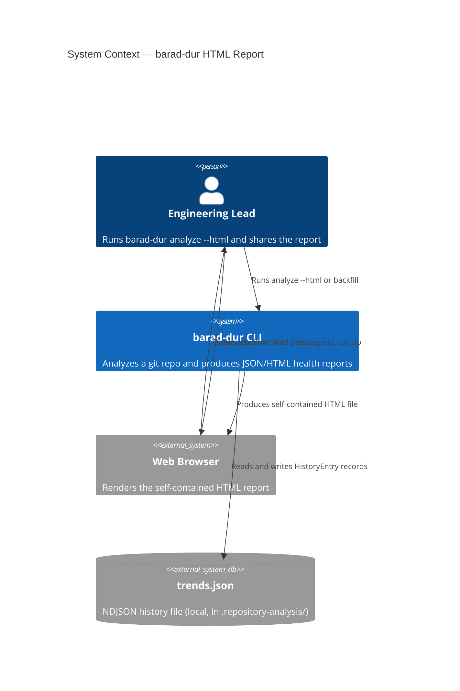
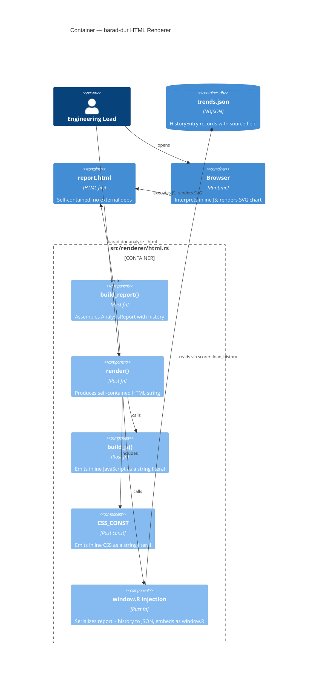
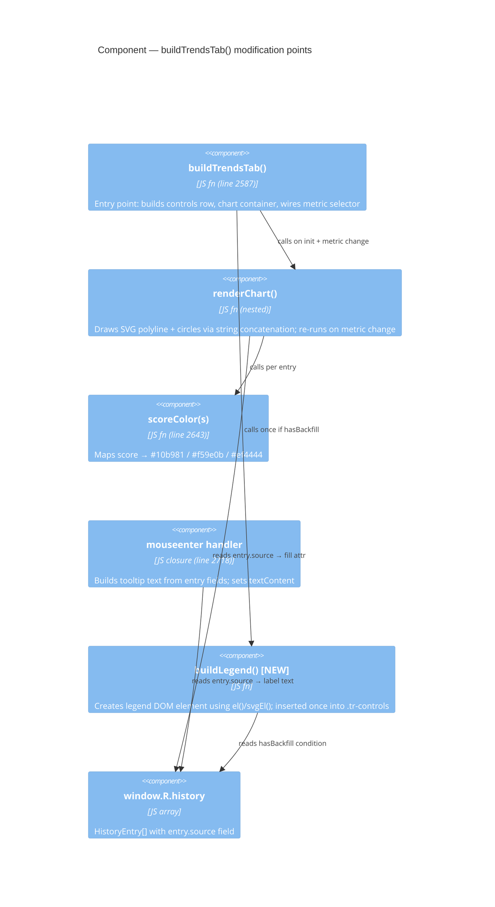

# Architecture Design: html-trend-graph-readability

## Summary

This feature adds visual source-type distinction (hollow vs filled dots), a conditional legend, and tooltip source labels to the Trends tab SVG chart in the self-contained HTML report. All changes are in a single bounded context: the inline JavaScript inside `src/renderer/html.rs`.

**Pattern**: Single-file renderer modification — no new components, no new dependencies, no Rust changes.
**Paradigm**: Functional (existing project paradigm).
**Scope**: `src/renderer/html.rs` only.

---

## C4 System Context



---

## C4 Container



---

## C4 Component — Trends Tab JS (modified area)



---

## Modification Points

Three targeted modifications to `src/renderer/html.rs`, all within the inline JS:

### 1. Circle fill encoding — `renderChart()` inner loop

**Current** (line ~2709):
```javascript
svg += '<circle class="tr-dot" cx="' + cx + '" cy="' + cy + '" r="4" fill="' + lineColor + '" '
  + 'data-idx="' + i + '" stroke="' + bgCol + '" stroke-width="1.5"/>';
```

**Modified**:
```javascript
var isBackfill = history[i].source === 'backfill';
var dotFill  = isBackfill ? 'none' : scoreColor(scores[i]);
var dotStroke = isBackfill ? scoreColor(scores[i]) : bgCol;
var pointerEvt = isBackfill ? 'all' : 'auto';
svg += '<circle class="tr-dot" cx="' + cx + '" cy="' + cy + '" r="4"'
  + ' fill="' + dotFill + '"'
  + ' stroke="' + dotStroke + '" stroke-width="1.5"'
  + ' style="pointer-events:' + pointerEvt + '"'
  + ' data-idx="' + i + '"/>';
```

**Why `pointer-events: all`**: SVG circles with `fill="none"` receive no pointer events by default in most browsers — the hit area is only the stroke, not the interior. Setting `pointer-events: all` restores the full circle as a hover target.

### 2. Tooltip source label — `mouseenter` handler

**Current** (line ~2730):
```javascript
var lines = dateStr + ' (' + head7 + ')\n'
  + metric + ': ' + getScore(entry, metric) + '\n'
  + entry.counts.commits + ' commits, ' + ...;
```

**Modified** — insert source line second (after date, before score):
```javascript
var sourceLabel = entry.source === 'backfill' ? 'Backfill' : 'Live analysis';
var lines = dateStr + ' (' + head7 + ')\n'
  + 'Source: ' + sourceLabel + '\n'
  + metric + ': ' + getScore(entry, metric) + '\n'
  + entry.counts.commits + ' commits, ' + ...;
```

### 3. Legend — new DOM element in `buildTrendsTab()`

**Placement**: Inserted into `.tr-controls` div after the metric `<select>`, before the chart. Created once at tab-build time, never re-rendered on metric change.

**Construction** (uses existing `el()` + `svgEl()` helpers — no innerHTML):
```javascript
var hasBackfill = history.some(function(e) { return e.source === 'backfill'; });
if (hasBackfill) {
  var lastScore = scores[scores.length - 1];
  var liveColor = scoreColor(lastScore);
  // Hollow symbol
  var hollowSym = svgEl('svg', {width:'14',height:'14','aria-hidden':'true'},
    svgEl('circle', {cx:'7',cy:'7',r:'5',fill:'none',stroke:'#8b949e','stroke-width':'1.5'})
  );
  // Filled symbol
  var filledSym = svgEl('svg', {width:'14',height:'14','aria-hidden':'true'},
    svgEl('circle', {cx:'7',cy:'7',r:'5',fill:liveColor})
  );
  var legend = el('div', {className:'tr-legend'},
    hollowSym, txt(' Backfill'),
    el('span', {className:'tr-legend-sep'}),
    filledSym, txt(' Live analysis')
  );
  controls.append(legend);
}
```

---

## CSS Additions

New classes to append to the `CSS_CONST` in `src/renderer/html.rs`:

```css
.tr-legend {
  display: flex;
  align-items: center;
  gap: 6px;
  font-size: 12px;
  color: #8b949e;
  margin-left: auto;
}
.tr-legend-sep {
  display: inline-block;
  width: 12px;
}
```

`margin-left: auto` pushes the legend to the right end of the flex `.tr-controls` row, keeping it clear of the metric selector.

---

## Data Flow

```
trends.json
  └─ HistoryEntry { source: Option<String>, ... }
       └─ serialized → window.R.history[i].source
            ├─ renderChart(): source === 'backfill' → fill="none", stroke=scoreColor
            ├─ mouseenter:   source === 'backfill' → "Source: Backfill"
            └─ buildLegend(): history.some(source==='backfill') → legend shown
```

---

## Constraints Carried Forward

| Constraint | Source | Implementation |
|-----------|--------|---------------|
| No `innerHTML` | D-07 / security hook | Legend uses `el()`/`svgEl()`; circle encoding modifies string template (existing pattern) |
| No external dependencies | NFR-1 | Vanilla JS + SVG only |
| `pointer-events: all` on hollow circles | NFR-5 / open question from DISCUSS | Inline style on SVG string element |
| Stroke-width ≥ 1.5px for dark legibility | NFR-4 | `stroke-width="1.5"` (same as existing) |
| Legend only when backfill entries exist | D-02 | `hasBackfill` guard |
| `entry.source === 'backfill'` strict equality | D-05 | All other values → live |

---

## Test Strategy

All tests are Rust unit tests in `src/renderer/html.rs` — the same module as the existing `html_trends_has_chart` test. Tests check the rendered HTML string for:

| Test | What to assert |
|------|---------------|
| `html_trends_backfill_dot_is_hollow` | `fill="none"` present for backfill entry index |
| `html_trends_live_dot_is_filled` | `fill="#10b981"` (or amber/red) for live entry |
| `html_trends_legend_shown_when_backfill_present` | HTML contains "Backfill" and "Live analysis" |
| `html_trends_legend_hidden_when_no_backfill` | HTML does not contain "Backfill" |
| `html_trends_tooltip_includes_source_backfill` | JS string contains `'Source: Backfill'` |
| `html_trends_tooltip_includes_source_live` | JS string contains `'Source: Live analysis'` |
| `html_trends_legacy_entry_is_filled` (no source field) | No `fill="none"` for undefined source |
| `html_trends_has_chart` (existing — must still pass) | Regression guard |
