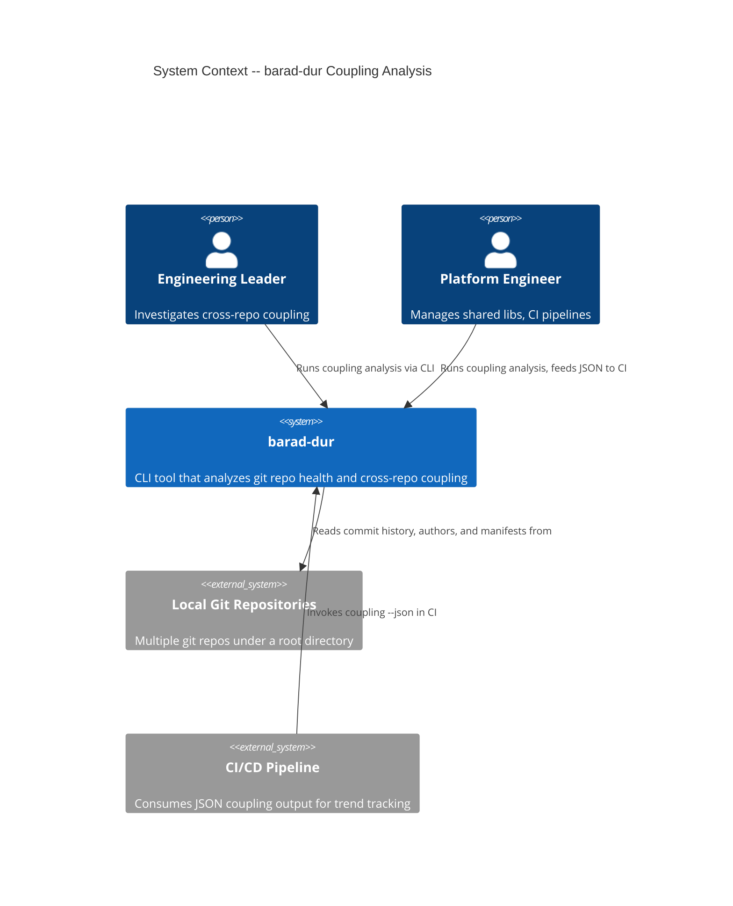
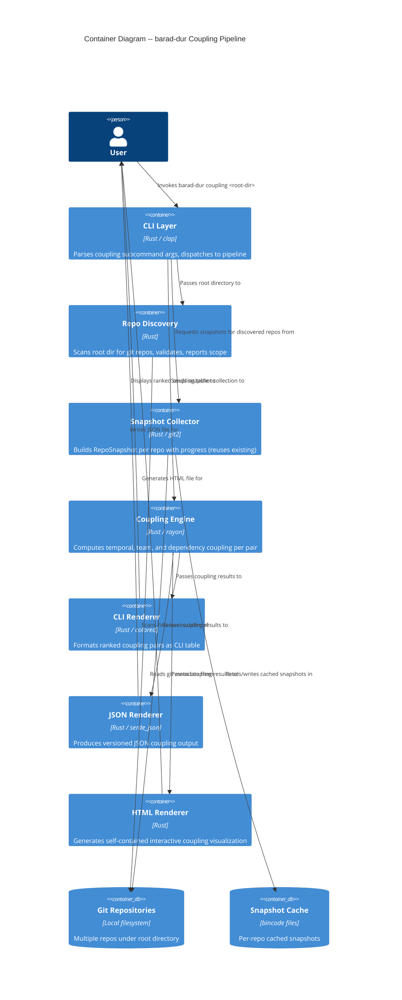

# Architecture Design -- Cross-Repository Coupling Detection

## Date
2026-03-26

## Status
PROPOSED

---

## 1. System Context and Capabilities

The cross-repository coupling detection feature extends barad-dur with a new `coupling` subcommand. It operates on a root directory containing multiple git repositories and produces pairwise coupling scores across three dimensions: temporal, team, and dependency.

### Capabilities by Release

| Release | Capability |
|---------|-----------|
| R1 | Repo discovery + snapshot collection + temporal coupling analysis + CLI output |
| R2 | Team coupling + dependency coupling + combined scoring + JSON output |
| R3 | HTML visualization (graph + matrix) + dimension filtering |

---

## 2. C4 System Context (L1)



---

## 3. C4 Container Diagram (L2)



---

## 4. Component Architecture

### 4.1 Pipeline Overview

The coupling analysis follows a five-stage pipeline, extending the existing `(snapshot) -> value` pattern to `(Vec<RepoSnapshot>) -> CouplingReport`:

```
Root Directory
  -> [Discovery] -> Vec<DiscoveredRepo>
  -> [Collection] -> Vec<RepoSnapshot>
  -> [Analysis] -> CouplingReport
  -> [Rendering] -> CLI Table | JSON | HTML
```

### 4.2 Module Boundaries

| Module | Responsibility | New or Existing |
|--------|---------------|----------------|
| `cli.rs` | `CouplingArgs` struct, `Commands::Coupling` variant | Extend existing |
| `coupling/discovery.rs` | Scan root dir, validate repos, report scope | New |
| `coupling/collector.rs` | Orchestrate per-repo snapshot collection with progress | New (thin wrapper over existing Collector) |
| `coupling/temporal.rs` | Temporal coupling computation for all pairs | New |
| `coupling/team.rs` | Team coupling computation (shared authors, bridges) | New (R2) |
| `coupling/dependency.rs` | Manifest scanning and dependency coupling | New (R2) |
| `coupling/types.rs` | Data types: CouplingReport, CouplingPair, CouplingConfig, DiscoveredRepo | New |
| `coupling/mod.rs` | Public API: `run_coupling_analysis(root, config) -> CouplingReport` | New |
| `renderer/coupling_cli.rs` | CLI table rendering for CouplingReport | New |
| `renderer/coupling_json.rs` | JSON rendering with versioned schema | New (R2) |
| `renderer/coupling_html.rs` | Self-contained HTML visualization | New (R3) |

### 4.3 Dependency Direction

```
main.rs
  -> cli.rs (parse args)
  -> coupling/mod.rs (orchestrate)
       -> coupling/discovery.rs (find repos)
       -> collector/mod.rs (existing, reused)
       -> coupling/temporal.rs (compute)
       -> coupling/team.rs (compute, R2)
       -> coupling/dependency.rs (compute, R2)
       -> coupling/types.rs (data model)
  -> renderer/coupling_cli.rs (render)
  -> renderer/coupling_json.rs (render, R2)
  -> renderer/coupling_html.rs (render, R3)
```

Dependencies flow inward: renderers depend on `coupling/types.rs`; analysis modules depend on `snapshot.rs`. No coupling module depends on renderers. No existing module is modified except `cli.rs` (additive: new enum variant) and `lib.rs` (additive: new `pub mod coupling`).

---

## 5. Integration Patterns

### 5.1 Reuse of Existing Collector

The coupling pipeline reuses `Collector::open()` and `collect_snapshot_verbose()` per discovered repo. The coupling-specific collector wrapper only adds:
- Parallel collection via rayon over discovered repos
- Progress bar showing repo name and count
- Skip-on-error: `Result<RepoSnapshot>` mapped to `Option<RepoSnapshot>`

### 5.2 RepoSnapshot Consumption (Not Modification)

Per NFR-03 and CC-05, the existing `RepoSnapshot` struct is NOT modified. The coupling engine consumes existing fields:
- `commits` (with `timestamp`) for temporal coupling
- `authors` (with `name`) for team coupling
- `name` for display
- `path` for manifest scanning (dependency coupling)

### 5.3 CLI Integration

The new `Commands::Coupling(CouplingArgs)` variant follows the same pattern as `Commands::Analyze(AnalyzeArgs)`. In `main.rs`, a new `run_coupling(args)` function is dispatched from the match arm.

---

## 6. Quality Attribute Strategies

### 6.1 Correctness

- Temporal coupling: binary search on sorted timestamps ensures precise co-change counting
- Configurable coupling window (default 24h) with sub-hour granularity support (format: `NNh`, `NNm`)
- Confidence levels (HIGH/MEDIUM/LOW) prevent over-interpretation of sparse data
- Minimum 3 co-changes threshold filters noise

### 6.2 Performance

- Parallel snapshot collection via rayon (already proven in existing collector)
- Parallel pair analysis via rayon: 50 repos = 1225 pairs, each pair comparison is O(N log N) -- parallelizable since pairs are independent
- Lightweight snapshot: coupling only needs commits (timestamps, authors), not blame or complexity. Consider a `collect_snapshot_lightweight()` variant that skips blame and complexity phases for coupling-only use
- Target: 1225 pairs in under 60 seconds (NFR-01)

### 6.3 Maintainability

- Modular monolith with dependency inversion: coupling engine depends on snapshot types (ports), not on collector internals
- Each coupling dimension is a separate module with a pure function signature: `fn compute_<dimension>(snapshots: &[RepoSnapshot], config: &CouplingConfig) -> Vec<DimensionResult>`
- Functional paradigm: pure functions, iterator chains, immutable inputs

### 6.4 Testability

- Each analysis function is pure: takes immutable data, returns results
- Types in `coupling/types.rs` are `#[derive(Debug, Clone, PartialEq)]` for assertion-friendly tests
- Integration tests: create temp git repos with planted commit patterns, run coupling analysis, verify scores

### 6.5 Backward Compatibility

- `barad-dur analyze` behavior completely unchanged (NFR-03)
- No modifications to existing `RepoSnapshot`, `AnalysisReport`, or scorer (CC-05)
- Coupling subcommand is purely additive

---

## 7. Open Questions Resolution (from DISCUSS wave)

### OQ-1: Coupling window granularity
**Decision**: Support hour and minute granularity. Format: `<number><unit>` where unit is `h` (hours) or `m` (minutes). Examples: `24h`, `48h`, `30m`. Default: `24h`. Parsed into `chrono::Duration`.

### OQ-2: Parallel pair analysis
**Decision**: Yes, parallelize via rayon. 1225 pairs at O(N log N) each warrants parallelism. Each pair comparison is independent (read-only on snapshots). Rayon's `par_iter` over the pair iterator.

### OQ-3: Cross-repo file-level coupling
**Decision**: Out of scope per DISCUSS wave conclusion. N^2 at file level across repos is computationally prohibitive. Repo-level coupling is the focus for all 3 releases.

### OQ-4: Graph library for HTML
**Decision**: Inline lightweight JS for force-directed graph (no D3.js). Follow the existing `renderer/html.rs` pattern of embedding all CSS/JS in the HTML template. A minimal force-directed layout (100-200 lines of JS) is sufficient for the expected graph size (up to 50 nodes). If the graph complexity exceeds this, D3.js can be inlined in a future iteration.

### OQ-5: GitLab group scan future extensibility
**Decision**: Design `CouplingArgs` with an optional `--source` argument reserved for future use. R1-R3 support only `Source::LocalDir(PathBuf)`. The coupling pipeline accepts `Vec<RepoSnapshot>` regardless of how repos were discovered, making the discovery layer pluggable.

### OQ-6: Combined coupling score formula
**Decision**: Weighted average with configurable weights. Default: temporal 50%, team 25%, dependency 25%. Rationale: temporal coupling is the strongest signal of operational coupling. The formula applies only when all three dimensions are available (R2+). In R1, only temporal is reported (no combined score).

---

## 8. Deployment Architecture

No change to deployment. barad-dur remains a single statically-linked Rust binary. The coupling subcommand is compiled into the same binary. No new services, databases, or infrastructure.

---

## 9. ADR References

| ADR | Decision |
|-----|----------|
| ADR-008 | Extend existing CLI with coupling subcommand (vs. separate tool) |

---

## 10. Architectural Enforcement

**Recommended tooling**: `cargo-modules` for verifying module dependency direction. Enforce that:
- `coupling/*` modules never import from `renderer/*`
- `renderer/coupling_*` modules only import from `coupling/types` and `snapshot`
- No existing module imports from `coupling/*`

Additionally, the existing test suite must continue to pass unchanged (backward compatibility gate).
