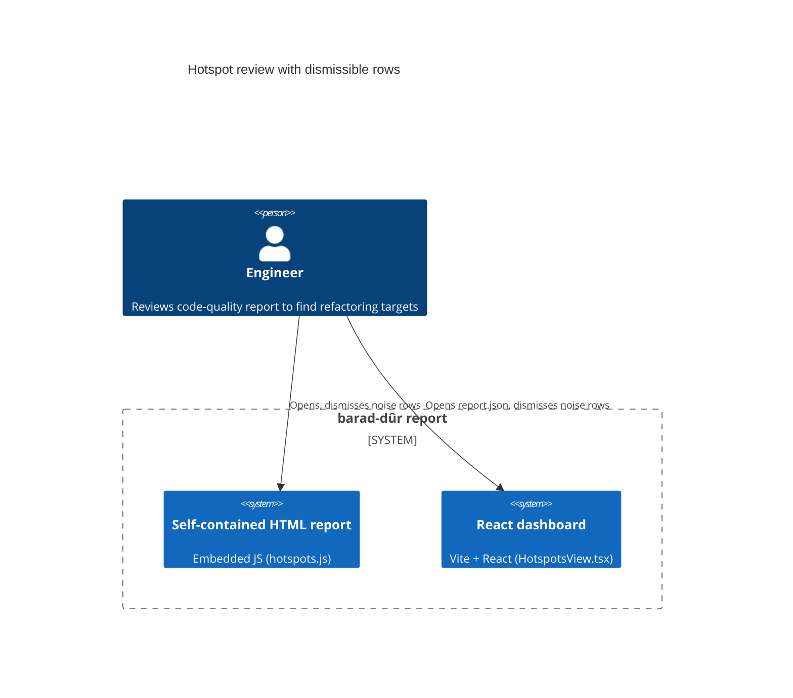
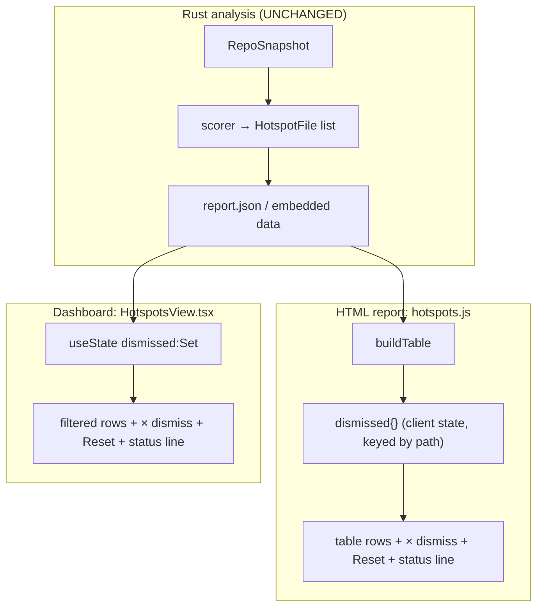

# Architecture Design — manifest-hotspot-exclusion

> **Pivot note**: DESIGN redirected this feature from snapshot-level manifest
> exclusion (the DISCUSS plan) to a **presentation-layer manual dismiss** of hotspot
> rows, mirroring the existing coupling-pair dismissal. Manifests are now the
> *motivating example*, not the mechanism. See `upstream-changes.md` for the
> requirement deltas this implies.

## Problem (restated)

The hotspots view lists files whether or not they are actionable code — `package.json`
and other config churn surface alongside real hotspots. Rather than removing files
from analysis, give the reader a client-side control to **dismiss any file from the
hotspots table**, exactly as coupling pairs can already be dismissed.

## Approach

Presentation-layer only. No collector, snapshot, scorer, or metric change — the
`HotspotFile` data is unchanged; surfaces filter it at render time. This makes the
deps/coupling safety concern (former NFR-1) moot: collection never changes.

Two surfaces, mirroring where coupling dismissal already lives plus the dashboard:

1. **HTML report** — `src/renderer/templates/hotspots.js` (`buildTable`), mirroring
   `coupling.js` dismiss block (lines ~67–191).
2. **React dashboard** — `dashboard/src/components/HotspotsView.tsx`.

## C4 — System Context (Mermaid)



## C4 — Container / Component (Mermaid)



The Rust column is untouched. Both view containers add an identical, isolated unit:
*client-side dismissal state filtering the rendered rows.*

## Components

### C1 — HTML report dismissal (`hotspots.js`)
- **Does**: lets the reader hide arbitrary hotspot rows in the table.
- **How**: extend `buildTable` with `var dismissed = {}` keyed by **file path**; add a
  trailing `×` button cell per row (`hs-dismiss`) → `dismissed[path]=true; renderTable()`;
  add a "Reset dismissed" button and a status line ("N dismissed"), mirroring
  `coupling.js`.
- **Depends on**: existing `el`/`txt`/`append` DOM builders (no `innerHTML`, per the
  security hook); the existing `buildTable` re-render path and `filterQuery`.
- **Boundary**: table only in v1; the scatter plot stays full (coupling has no plot,
  so "mirror coupling" does not constrain it). Scatter-sync is a noted enhancement.

### C2 — Dashboard dismissal (`HotspotsView.tsx`)
- **Does**: same capability in the React table.
- **How**: `const [dismissed, setDismissed] = useState<Set<string>>(new Set())`;
  compute `visible = files.filter(f => !dismissed.has(f.path))` and drive the table
  (and, since it is cheap here, the d3 effect deps) from `visible`; add a `×` button
  column → `setDismissed(prev => new Set(prev).add(f.path))`; add Reset + status line.
- **Depends on**: existing `HotspotFile` type, sort state.
- **Boundary**: keyed by **path**, not array index, so sort/filter stay correct.

## State & data model
- No new persisted data. Dismissal is **ephemeral client state** (mirrors coupling;
  lost on reload/re-import). `HotspotFile` (`dashboard/src/types.ts`) is unchanged.
- Persistence (localStorage / config) is explicitly out of scope for v1 — see ADR-009.

## Technology stack
- Unchanged. HTML side: vanilla JS embedded via `include_str!` (`renderer/html.rs`).
  Dashboard: React 19 + d3 + TypeScript. No new dependencies.

## Paradigm
- N/A for the pure-function metric core — this feature lives entirely in presentation
  templates, not the `(snapshot) → MetricValue` layer. No `CLAUDE.md` paradigm change.

## Testing strategy (as implemented)
- **HTML report**: `src/renderer/html/tests.rs` asserts on rendered substrings.
  `html_hotspots_has_dismiss_controls` checks the hotspots HTML contains the
  hotspots-specific control markers (`hs-dismiss`, `hs-dismiss-reset`). Rust cannot
  exercise the JS click behavior — that remains verified manually / by visual check
  (consistent with how `coupling.js` dismissal is validated).
- **Dashboard**: a test harness was **added** (vitest + @testing-library/react +
  jsdom; `vite.config.ts` `test` block; `src/test-setup.ts` provides a `getBBox`
  shim so d3 renders under jsdom). `HotspotsView.test.tsx` covers dismiss (row
  removed) and reset (row restored) behavior via RED→GREEN. This supersedes the
  earlier "no harness / manual only" assumption.
- **Acceptance**: see criteria in `upstream-changes.md` (DISCUSS AC-1..5, written
  against `is_excluded`, no longer apply).

## Risks
- **R1 — partially-untested JS behavior**: the HTML-report dismissal logic is
  client-side and the Rust suite only asserts control *presence*, not click behavior.
  Mitigation: logic is a near-copy of the proven `coupling.js` pattern + Rust HTML
  presence test. The dashboard equivalent is now fully behavior-tested (vitest+RTL),
  so this risk is confined to the HTML-report JS.
- **R2 — surface drift**: two implementations (JS + React) can diverge. Mitigation:
  identical semantics (dismiss by path, ephemeral, Reset); document both here.
```
