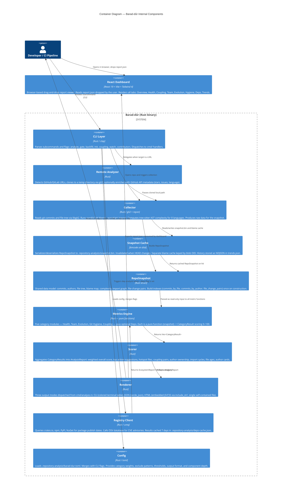

# C4 Container Diagram — Barad-dûr

Internal components of Barad-dûr and how they relate to each other.
The binary is a single Rust crate; the containers below represent logical
modules with clear input/output contracts rather than separate deployed
services. The React Dashboard is a separate static web application bundled
under `dashboard/`.

