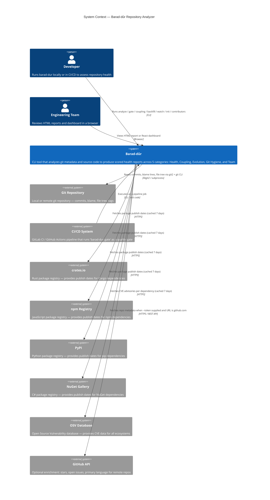

# C4 Context Diagram — Barad-dûr

Barad-dûr in relation to the people and external systems it interacts with.
A developer runs the tool locally or wires it into a CI/CD pipeline; the tool
reaches out to package registries and the OSV vulnerability database on demand,
and can optionally enrich remote-URL analyses via the GitHub API.

