# Data Flow Diagram — Barad-dûr Analysis Pipeline

The full transformation chain from raw git data to output reports.
Every arrow represents data being passed between pure-function stages;
the only I/O side-effects are the cache reads/writes shown on the left
and the output writes shown on the right.

```mermaid
flowchart TD
    subgraph Sources["Git Repository (on disk)"]
        G1[git log / commit graph]
        G2[git blame --porcelain\n&#40;parallel, one proc per file&#41;]
        G3[HEAD file tree\n&#40;git ls-tree via libgit2&#41;]
        G4[Lock files\n&#40;Cargo.lock, package-lock.json,\nrequirements.txt, *.csproj&#41;]
        G5[Source files\n&#40;tree-sitter AST complexity&#41;]
    end

    subgraph CacheLayer["Cache Layer (.repository-analysis/)"]
        C1[(snapshot.bin\nbincode)]
        C2[(blame cache\nkeyed by blob OID)]
        C3[(deps-cache.json\n7-day TTL)]
        C4[(trends.json\nNDJSON history)]
    end

    subgraph Collection["Collector (src/collector/)"]
        COL1[libgit.rs\ncollect_commits\ncollect_files]
        COL2[gitcli.rs\ncollect_blame_cached]
        COL3[snapshot_builder.rs\nbuild_indexes]
        COL4[collector/deps.rs\ncollect_locked_deps]
    end

    subgraph SnapshotModel["RepoSnapshot (src/snapshot/)"]
        SN["RepoSnapshot\n• commits: Vec&lt;Commit&gt;\n• authors: Vec&lt;Author&gt;\n• files: Vec&lt;FileEntry&gt;\n• blame_map: HashMap&lt;Path, Vec&lt;BlameLine&gt;&gt;\n• complexity: HashMap&lt;Path, FileComplexity&gt;\n• commits_by_file / commits_by_author (indexes)\n• file_change_pairs (co-change pairs)\n• import_graph (edges, cycles)"]
    end

    subgraph MetricsEngine["Metrics Engine (src/metrics/) — pure functions"]
        M1["health::\ncompute_health\n&#40;bus factor, file size,\nbinary files, shallow clone&#41;"]
        M2["team::\ncompute_team\n&#40;author distribution,\nownership, churn&#41;"]
        M3["evolution::\ncompute_evolution\n&#40;commit frequency,\nfile age, velocity&#41;"]
        M4["hygiene::\ncompute_hygiene\n&#40;merge commits, fixup rate,\nmessage quality, wip commits&#41;"]
        M5["coupling::\ncompute_coupling\n&#40;co-change pairs,\nimport cycles, component depth&#41;"]
        M6["deps::\ncompute_deps\n&#40;drift years, CVEs,\nper ecosystem&#41;"]
    end

    subgraph RegistryLayer["Registry Client (src/registry/)"]
        R1[crates.io / npm /\nPyPI / NuGet]
        R2[OSV Database\n&#40;CVE advisories&#41;]
    end

    subgraph ScorerLayer["Scorer (src/scorer/)"]
        SC["build_report\n• weighted overall score\n  &#40;Health 25%, Evolution 25%,\n   Hygiene 20%, Coupling 20%, Team 10%&#41;\n• top action suggestions\n• hotspot files\n• coupling pairs\n• author ownership\n• import cycles\n• file ages\n• author cards\n→ AnalysisReport"]
    end

    subgraph Outputs["Renderer (src/renderer/) + History"]
        O1[CLI\ncolored terminal table\nwith score bands]
        O2[JSON\nserde_json\nmachine-readable]
        O3[HTML\nself-contained file\nembedded JS + CSS]
        O4[(trends.json\nappend history entry)]
        O5[React Dashboard\ndrops report.json]
    end

    G1 --> COL1
    G3 --> COL1
    G2 --> COL2
    G5 --> COL1
    G4 --> COL4

    C1 -- cache hit --> SN
    C2 --> COL2

    COL1 --> COL3
    COL2 --> COL3
    COL3 --> SN
    COL3 --> C1

    COL4 --> R1
    COL4 --> R2
    R1 --> M6
    R2 --> M6
    C3 <--> R1

    SN --> M1
    SN --> M2
    SN --> M3
    SN --> M4
    SN --> M5

    M1 & M2 & M3 & M4 & M5 & M6 --> SC

    SC --> O1
    SC --> O2
    SC --> O3
    SC --> O4
    O2 --> O5

    style Sources fill:#dbeafe,stroke:#3b82f6
    style CacheLayer fill:#fef9c3,stroke:#ca8a04
    style Collection fill:#dcfce7,stroke:#16a34a
    style SnapshotModel fill:#f0fdf4,stroke:#16a34a
    style MetricsEngine fill:#ede9fe,stroke:#7c3aed
    style RegistryLayer fill:#fce7f3,stroke:#db2777
    style ScorerLayer fill:#fff7ed,stroke:#ea580c
    style Outputs fill:#f1f5f9,stroke:#475569
```

