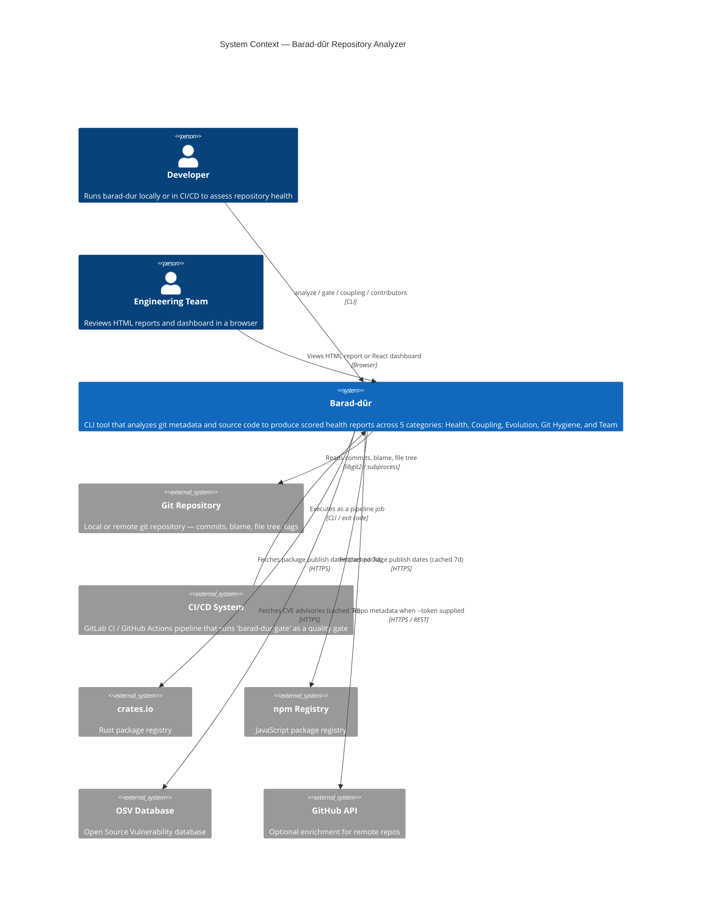
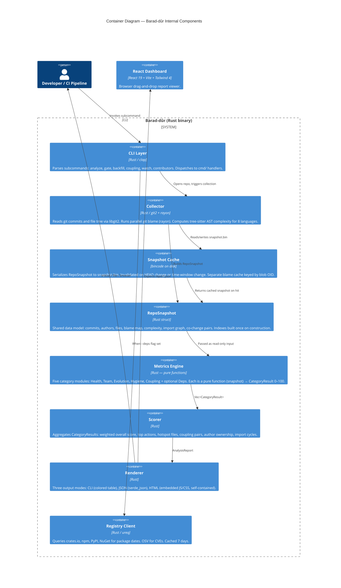
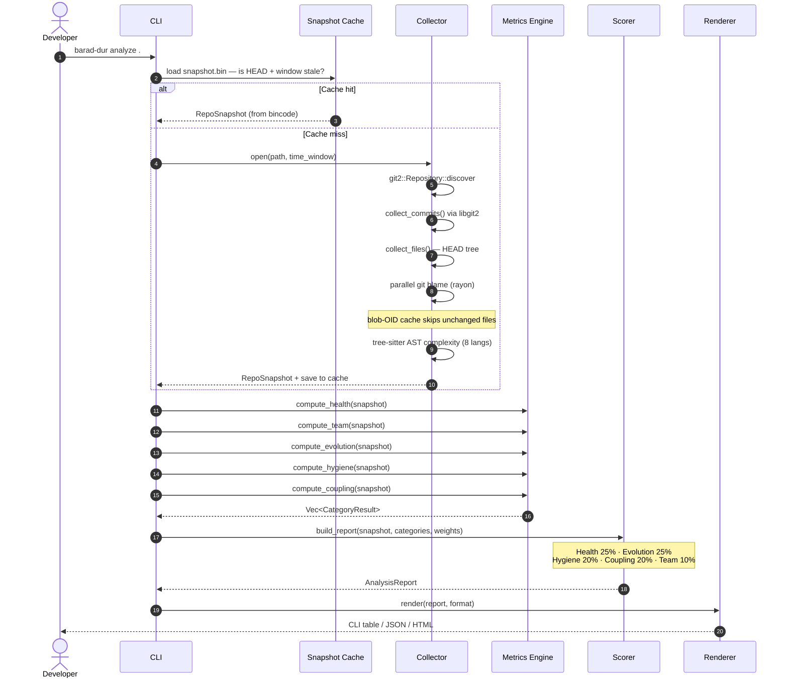

# Barad-dûr

**The All-Seeing Repository Analyzer**

<div class="mt-8 text-gray-400 text-xl">
One command. A score. A list of what to fix next.
</div>

<div class="abs-br m-8 flex gap-2 text-sm text-gray-500">
  <span>github.com/edouard-mangel/Barad-Dur</span>
</div>

<!--
Welcome. Today I'm going to show you a tool I built to answer a question that
I think every engineer has had at some point: is this codebase healthy?

Not "does it compile" — we have CI for that. I mean: is it well-structured,
well-maintained, sustainable? The kind of question you usually answer with
a gut feeling after spending a few weeks in the code.

What if you could measure that in one command?
-->

---
layout: center
class: text-center
---

# You inherit a codebase.

<div v-click class="mt-6 text-2xl text-gray-300">
How do you know if it's healthy?
</div>

<div v-click class="mt-6 text-3xl font-bold text-amber-400">
You ask someone.
</div>

<div v-click class="mt-4 text-xl text-gray-400 italic">
And they give you a vibe.
</div>

<!--
We've all been there. New project, new codebase. You open a PR and someone
says "careful, that module is a mess." Or you discover a file that everyone
is afraid to touch. Or you find out the hard way that two unrelated files
always have to change together.

This knowledge lives in people's heads. And when those people leave, it
vanishes.
-->

---
layout: two-cols
---

## The hidden costs of "vibe-based" review

<div class="mt-4 space-y-4">

<div v-click>

**Bus factor**
One person owns 80% of the critical path.
Nobody knows until they're gone.

</div>

<div v-click>

**Logical coupling**
Two files always change together.
Nothing in the code reveals this.
Only git history does.

</div>

<div v-click>

**Dependency drift**
That library you pinned two years ago?
It has three CVEs now.

</div>

</div>

::right::

<div class="mt-16 ml-8 space-y-4">

<div v-click class="p-4 rounded-lg bg-red-900/30 border border-red-700/50 text-sm">
  <div class="font-bold text-red-400">Real incident</div>
  <div class="text-gray-300 mt-1">Mocked tests passed. Production migration failed. The mock didn't match the real DB schema.</div>
</div>

<div v-click class="p-4 rounded-lg bg-amber-900/30 border border-amber-700/50 text-sm">
  <div class="font-bold text-amber-400">Real incident</div>
  <div class="text-gray-300 mt-1">Senior engineer left. Nobody knew which 40 files they were the only author of. Six months of on-call pain followed.</div>
</div>

</div>

<!--
These aren't abstract problems. Every team I've talked to has a version of
these stories. The information exists — it's in the git history — but nobody
is reading it systematically.
-->

---
layout: center
class: text-center
---

# What if git history could answer these questions automatically?

<div v-click class="mt-8 text-5xl font-bold text-cyan-400">
It can.
</div>

<!--
Everything I just described — bus factor, coupling, drift — is computable
from git history and static analysis. The data is all there. Nobody was
reading it.

That's what Barad-dûr does.
-->

---
layout: center
---

## One command. Any repo.

```bash {1|2|3-8}
# No install, no config file, no setup
docker run --rm -v ./your-repo:/repo \
  lab.frogg.it:5050/edouard_mangel/barad-dur

━━━ Barad-dûr ━━━━━━━━━━━━━━━━━━━━━━━━━━━━━━━━━━━━
  Repository: your-repo on main
  Scope: 1,247 commits · 23 authors · 891 files
  Window: last 6 months
```

<div v-click class="mt-6 flex justify-center gap-8 text-center">
  <div class="p-4 rounded-lg bg-slate-800 min-w-24">
    <div class="text-3xl font-bold text-green-400">78</div>
    <div class="text-sm text-gray-400 mt-1">Overall</div>
  </div>
  <div class="p-4 rounded-lg bg-slate-800 min-w-24">
    <div class="text-3xl font-bold text-green-400">82</div>
    <div class="text-sm text-gray-400 mt-1">Health</div>
  </div>
  <div class="p-4 rounded-lg bg-slate-800 min-w-24">
    <div class="text-3xl font-bold text-amber-400">61</div>
    <div class="text-sm text-gray-400 mt-1">Coupling</div>
  </div>
  <div class="p-4 rounded-lg bg-slate-800 min-w-24">
    <div class="text-3xl font-bold text-green-400">85</div>
    <div class="text-sm text-gray-400 mt-1">Evolution</div>
  </div>
  <div class="p-4 rounded-lg bg-slate-800 min-w-24">
    <div class="text-3xl font-bold text-amber-400">67</div>
    <div class="text-sm text-gray-400 mt-1">Hygiene</div>
  </div>
  <div class="p-4 rounded-lg bg-slate-800 min-w-24">
    <div class="text-3xl font-bold text-green-400">74</div>
    <div class="text-sm text-gray-400 mt-1">Team</div>
  </div>
</div>

<!--
This is the entire install step. One Docker command. Mount your repo. Get a report.

The output is five categories, each scored 0 to 100. Green is good, amber is
a warning, red needs attention. You can see at a glance where to focus.

Let me show you what it actually looks like live.
-->

---
layout: center
class: text-center
---

# System Context

Who uses Barad-dûr and what does it talk to?

<!--
Before the live demo, let me place the tool in context.
This is a C4 context diagram — it shows Barad-dûr relative to the people
and systems around it.
-->

---

## C4 Context — Barad-dûr in its environment



<!--
Two types of users: the developer running it locally or in CI, and the
engineering team reviewing the HTML report or dashboard.

Externally it reads git history, optionally queries package registries for
dependency age, and the OSV database for CVEs. All external calls are cached
for 7 days so you don't hammer the APIs on every run.
-->

---
layout: center
class: text-center
---

<div class="text-6xl font-bold text-cyan-400">
LIVE DEMO
</div>

<div class="mt-4 text-xl text-gray-400">
<code>bash demo.sh</code>
</div>

<div class="mt-8 text-sm text-gray-500">
  ENTER → next step &nbsp;·&nbsp; s → skip &nbsp;·&nbsp; q → quit
</div>

<!--
Let's switch to the terminal. I'll run through 9 steps.
Each one shows a real command against a real repository.

Switch to terminal: bash docs/presentation/demo.sh
-->

---
layout: two-cols
---

## Demo recap — what we just saw

<div class="mt-4 space-y-3 text-sm">

<div v-click class="flex gap-3 items-start">
  <span class="text-cyan-400 font-mono mt-0.5">①</span>
  <div><strong>Zero-install Docker run</strong> — mount any repo, get a score immediately</div>
</div>

<div v-click class="flex gap-3 items-start">
  <span class="text-cyan-400 font-mono mt-0.5">②③</span>
  <div><strong>Time windows</strong> — <code>--since 3months</code> and <code>--all</code> to scope the analysis</div>
</div>

<div v-click class="flex gap-3 items-start">
  <span class="text-cyan-400 font-mono mt-0.5">④</span>
  <div><strong>Logical coupling</strong> — files that always change together, surfaced from git log</div>
</div>

<div v-click class="flex gap-3 items-start">
  <span class="text-cyan-400 font-mono mt-0.5">⑤</span>
  <div><strong>HTML report</strong> — self-contained file, opens offline, no server needed</div>
</div>

<div v-click class="flex gap-3 items-start">
  <span class="text-cyan-400 font-mono mt-0.5">⑥</span>
  <div><strong>JSON output</strong> — pipe into jq, store in a dashboard, build your own tooling</div>
</div>

<div v-click class="flex gap-3 items-start">
  <span class="text-cyan-400 font-mono mt-0.5">⑦</span>
  <div><strong>CI gate</strong> — <code>exit 1</code> below a threshold, wires into any pipeline</div>
</div>

</div>

::right::

<div class="ml-8 mt-8 space-y-4 text-sm">

<div v-click class="p-4 rounded-lg bg-slate-800">
<div class="text-xs text-gray-500 mb-2 font-mono">DOCKER ONE-LINER</div>

```bash
docker run --rm \
  -v ./repo:/repo \
  lab.frogg.it:5050/edouard_mangel/barad-dur
```
</div>

<div v-click class="p-4 rounded-lg bg-slate-800">
<div class="text-xs text-gray-500 mb-2 font-mono">CI GATE</div>

```yaml
quality-gate:
  script:
    - barad-dur gate . --min-score 70
```
</div>

<div v-click class="p-4 rounded-lg bg-slate-800">
<div class="text-xs text-gray-500 mb-2 font-mono">JSON FOR TOOLING</div>

```bash
barad-dur analyze . --json \
  | jq '.actions[:3][].title'
```
</div>

</div>

<!--
Quick summary of what we saw. The key point: everything you just saw was
the same binary, the same git history, different flags.

No agents, no LLM, no cloud service. Just deterministic, reproducible
analysis on your local machine.
-->

---
layout: center
class: text-center
---

# How does it work?

<div class="mt-4 text-gray-400">
For the engineers in the room
</div>

<!--
Now let's lift the hood. I'll keep this brief — the architecture is
deliberately simple, and that simplicity is the point.
-->

---

## C4 Container — internal components



<!--
Single Rust binary. The logical boundaries are modules, not services —
no microservices, no network hops, no daemon.

The key insight: RepoSnapshot is built once and passed as a read-only
value to all metric functions. Each category module is a pure function
that takes the snapshot and returns a score. Easy to test, easy to add new metrics.
-->

---

## Data pipeline

```mermaid {scale: 0.58}
flowchart LR
    subgraph Sources["Git Repository"]
        G1[git log]
        G2[git blame\nparallel]
        G3[file tree]
        G4[lock files]
        G5[source AST]
    end

    subgraph Cache["Cache (.repository-analysis/)"]
        C1[(snapshot.bin)]
        C2[(blame cache\nblob OID)]
        C3[(deps-cache\n7-day TTL)]
    end

    subgraph Collect["Collector"]
        COL[libgit.rs\ngitcli.rs\nsnapshot_builder.rs]
    end

    subgraph Snap["RepoSnapshot"]
        SN["commits · authors\nfiles · blame\ncomplexity · imports\nco-change pairs"]
    end

    subgraph Metrics["Metrics Engine — pure functions"]
        M1[Health]
        M2[Team]
        M3[Evolution]
        M4[Hygiene]
        M5[Coupling]
        M6[Deps]
    end

    subgraph Reg["Registries"]
        R1[crates.io\nnpm · PyPI]
        R2[OSV CVEs]
    end

    subgraph Score["Scorer"]
        SC["AnalysisReport\nweighted score\nactions · hotspots"]
    end

    subgraph Out["Outputs"]
        O1[CLI]
        O2[JSON]
        O3[HTML]
    end

    G1 & G2 & G3 & G5 --> COL
    G4 --> R1 & R2
    C1 -- hit --> SN
    C2 --> COL
    COL --> SN --> C1
    SN --> M1 & M2 & M3 & M4 & M5
    R1 & R2 --> M6
    R1 <--> C3
    M1 & M2 & M3 & M4 & M5 & M6 --> SC
    SC --> O1 & O2 & O3

    style Sources fill:#1e3a5f,stroke:#3b82f6
    style Cache fill:#3d2e00,stroke:#ca8a04
    style Collect fill:#14532d,stroke:#16a34a
    style Snap fill:#1a3a1a,stroke:#22c55e
    style Metrics fill:#2e1065,stroke:#7c3aed
    style Reg fill:#500724,stroke:#db2777
    style Score fill:#431407,stroke:#ea580c
    style Out fill:#1e293b,stroke:#475569
```



<!--
This is the full data pipeline left to right. The key properties:
- Everything to the right of the snapshot is pure computation — no I/O
- The cache short-circuits the expensive collection phase on repeated runs
- The five metric modules run independently and could be parallelized
- Deps is the only optional path — requires --deps flag and a lock file
-->

---

## Sequence — `barad-dur analyze .`



<!--
The sequence makes the cache benefit obvious: steps 3–9 (collection)
are skipped on a cache hit. For a large repo, blame is the expensive
step — rayon parallelizes it across files, and the blob-OID cache skips
files whose content hasn't changed between runs.

The five metric functions at the bottom are pure and independent — they
just take the snapshot struct and return a score.
-->

---
layout: two-cols
---

## Design principles

<div class="mt-4 space-y-6">

<div v-click>

### Pure functions all the way down

```rust
// Every metric module follows this contract
fn compute_health(snapshot: &RepoSnapshot) -> CategoryResult {
    // no I/O, no mutation, deterministic
}
```

Same snapshot = same result, always. Easy to test.

</div>

<div v-click>

### Cache invalidation you can reason about

The snapshot cache is stale when:
- HEAD commit changes, **or**
- The requested time window changes

```rust
pub fn is_stale(cached: &RepoSnapshot,
                current_head: &str,
                requested: &TimeWindow) -> bool
```

</div>

</div>

::right::

<div class="ml-8 mt-4 space-y-6">

<div v-click>

### Adding a metric takes 3 steps

1. Pure function in `src/metrics/<module>.rs`
2. Register in `src/scorer.rs` → `build_report()`
3. Unit tests via `src/metrics/testutil.rs`

No framework. No magic. Just a function.

</div>

<div v-click>

### Security enforced at the pipeline level

```
cargo deny   → blocks known CVEs on every push
cargo audit  → advisory database check
semgrep      → static taint analysis
```

The `deny` job failed this morning — two `git2` advisories.
Fixed, merged, shipped in the same session. 🔧

</div>

</div>

<!--
The functional paradigm was a deliberate choice. Pure functions are trivial
to test, trivial to reason about, and trivial to parallelise.

The cache invalidation bug we fixed today — the --since flag being ignored —
is a perfect example of why the time window has to be part of the cache key,
not just the HEAD commit hash.

The security pipeline caught it, the fix was two lines of Rust.
-->

---
layout: two-cols
---

## What's next

<div class="mt-4 space-y-4 text-sm">

<div v-click class="p-3 rounded-lg bg-slate-800 border-l-4 border-cyan-500">
  <div class="font-bold text-cyan-400">Afferent / efferent coupling metrics</div>
  <div class="text-gray-300 mt-1">Fan-in and fan-out per module. Identifies God modules and overly abstract utilities.</div>
</div>

<div v-click class="p-3 rounded-lg bg-slate-800 border-l-4 border-purple-500">
  <div class="font-bold text-purple-400">Instability index</div>
  <div class="text-gray-300 mt-1">Robert Martin's I = Ce / (Ca + Ce). Quantifies how much a module resists change.</div>
</div>

<div v-click class="p-3 rounded-lg bg-slate-800 border-l-4 border-green-500">
  <div class="font-bold text-green-400">Watch mode</div>
  <div class="text-gray-300 mt-1">Post-commit hook that prints a delta summary after each commit. Instant feedback loop.</div>
</div>

<div v-click class="p-3 rounded-lg bg-slate-800 border-l-4 border-amber-500">
  <div class="font-bold text-amber-400">Multi-repo coupling</div>
  <div class="text-gray-300 mt-1">Detect temporal coupling across repo boundaries in a monorepo workspace.</div>
</div>

</div>

::right::

<div class="ml-8 mt-8 space-y-4 text-sm">

<div v-click>

**Mutation testing in CI**
Every push runs mutation tests scoped to changed files.
Kill rate ≥ 80% required to merge.

```yaml
mutation-gate:
  script:
    - cargo mutants --in-place
      --timeout 60
      --jobs 4
```

</div>

<div v-click>

**Dogfooding score**

We run Barad-dûr on itself on every push.

<div class="mt-2 flex gap-3">
  <div class="p-2 rounded bg-slate-700 text-center flex-1">
    <div class="text-xl font-bold text-green-400">83</div>
    <div class="text-xs text-gray-400">today</div>
  </div>
  <div class="p-2 rounded bg-slate-700 text-center flex-1">
    <div class="text-xl font-bold text-green-400">↑ +4</div>
    <div class="text-xs text-gray-400">this month</div>
  </div>
</div>

</div>

</div>

<!--
Three things I find genuinely interesting about what's coming:

Afferent/efferent coupling is the metric that tells you which modules
are "load-bearing" vs "disposable". It's the difference between a module
that many things depend on vs one that depends on many things.

The instability index from Robert Martin's package design principles.
A module with high instability is fine if it's a leaf. If it's a shared
dependency with high instability, you have a problem.

And watch mode — imagine seeing a score delta after every commit.
"Your coupling score dropped 3 points. Here's why." That's the feedback
loop I want.
-->

---
layout: center
class: text-center
---

# Try it now

<div class="mt-6 text-left inline-block">

```bash
docker run --rm -v ./your-repo:/repo \
  lab.frogg.it:5050/edouard_mangel/barad-dur
```

</div>

<div class="mt-8 flex gap-12 justify-center text-sm text-gray-400">
  <div>
    <div class="text-white font-bold">Source</div>
    <div>github.com/edouard-mangel/Barad-Dur</div>
  </div>
  <div>
    <div class="text-white font-bold">Registry</div>
    <div>lab.frogg.it:5050/edouard_mangel/barad-dur</div>
  </div>
  <div>
    <div class="text-white font-bold">Issues / PRs</div>
    <div>GitHub mirror — open, welcome</div>
  </div>
</div>

<div class="mt-12 text-3xl">
  🙋 Questions?
</div>

<!--
That's the whole talk. One command, five categories, a score from 0 to 100,
and a list of what to fix next.

If you run it tonight on your own repo and the coupling score is alarming,
that's a feature, not a bug.

I'm happy to take questions.
-->

---
layout: center
class: text-center
---

## Appendix — Scoring weights

| Category | Weight | What it measures |
|---|---|---|
| **Health** | 25% | Bus factor, binary files, file sizes, shallow clone |
| **Evolution** | 25% | Commit frequency, file ages, churn velocity |
| **Hygiene** | 20% | WIP commits, fixup rate, merge commit ratio |
| **Coupling** | 20% | Co-change pairs, import cycles, component depth |
| **Team** | 10% | Author distribution, ownership concentration |

<div class="mt-4 text-sm text-gray-400">
Weights are configurable per-repo via <code>.repository-analysis/barad-dur.toml</code>
</div>

<!--
Backup slide for the Q&A. The weights are opinionated defaults — every team
can tune them. A security-focused team might weight Deps more heavily.
A legacy-codebase team might care more about Evolution.
-->

---
layout: center
class: text-center
---

## Appendix — Score bands

<div class="mt-6 flex gap-6 justify-center">
  <div class="p-6 rounded-xl bg-green-900/40 border border-green-700/50 min-w-36">
    <div class="text-4xl font-bold text-green-400">71–100</div>
    <div class="text-green-300 mt-2 font-semibold">Good</div>
    <div class="text-sm text-gray-400 mt-1">Healthy, maintainable</div>
  </div>
  <div class="p-6 rounded-xl bg-amber-900/40 border border-amber-700/50 min-w-36">
    <div class="text-4xl font-bold text-amber-400">41–70</div>
    <div class="text-amber-300 mt-2 font-semibold">Warning</div>
    <div class="text-sm text-gray-400 mt-1">Technical debt accumulating</div>
  </div>
  <div class="p-6 rounded-xl bg-red-900/40 border border-red-700/50 min-w-36">
    <div class="text-4xl font-bold text-red-400">0–40</div>
    <div class="text-red-300 mt-2 font-semibold">Critical</div>
    <div class="text-sm text-gray-400 mt-1">Needs immediate attention</div>
  </div>
</div>

<div class="mt-8 text-sm text-gray-400">
Band thresholds are serialised into every report and read by the dashboard.<br/>
They are never hardcoded in the renderer.
</div>

<!--
The band thresholds live in scorer/types.rs and are serialised into every
report. The renderer reads them from the report — it never hardcodes 71 or 41.
This means you can tune them and the HTML report will reflect your thresholds
automatically.
-->
